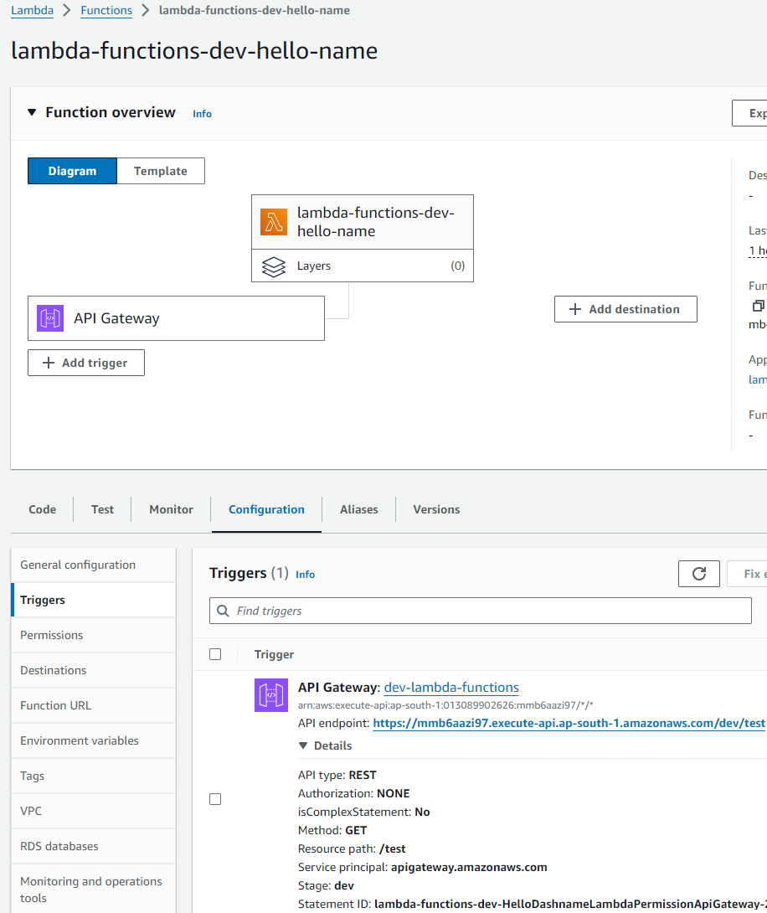

# lambda-monorepo

Implementaion of monorepo using lambda workspaces. Includes packages of lambda-functions and serverless infrastructure code for lambda functions deployment.

## For linting
    - Run cmd "yarn lint"

## Run unit tests
    - Run cmd "yarn workspace lambda-functions test"

## How to run on local
    1. From root directory run "yarn install" to install all dependencies.
    
    2. To test lambda function using serverless-offline run cmd "yarn workspace infrastructure run sls-off". 
    
    3. Then go to http://localhost:3000/dev/test

    4. To open Swagger documentaion run cmd "yarn workspace lambda-functions run swagger".
    for swagger go to http://localhost:3001/api-docs

## Deploy aws lambda and api-gateway using serverless
    1. Compile lambda to javascript
    run cmd "yarn workspace lambda-functions build"
   
    2. Deploy using serverless
    run cmd "yarn workspace infrastructure run sls-deploy"

    3. This will deploy lambda function and attach api gateway trigger to the function

### Test example

